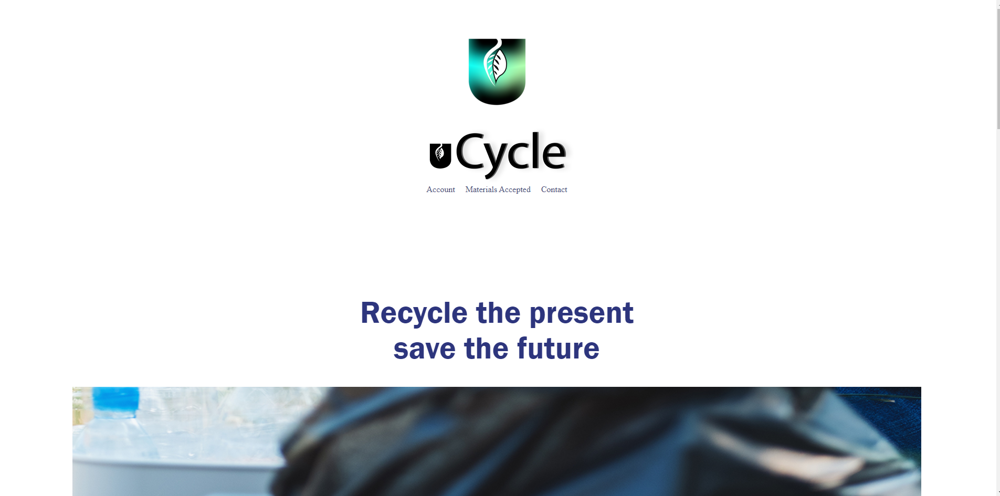
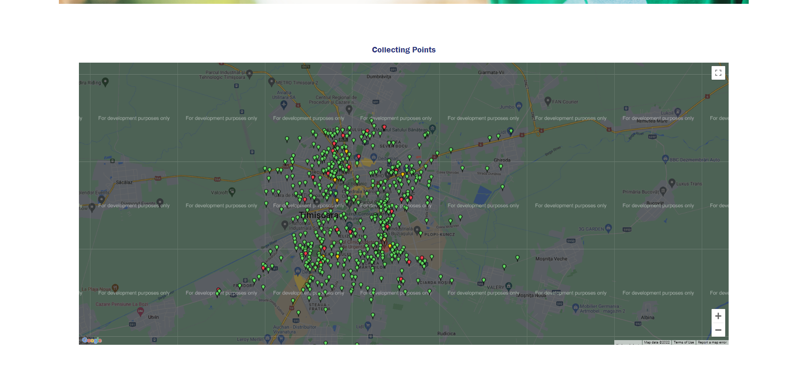
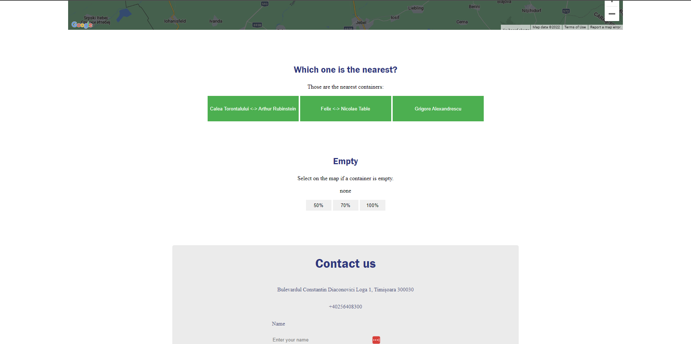
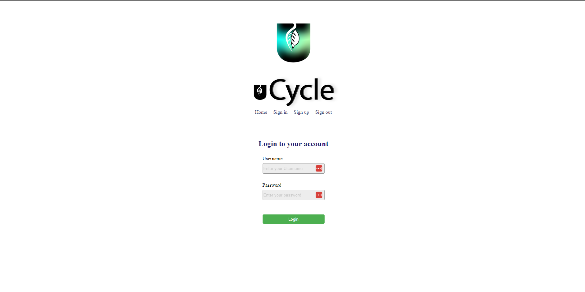
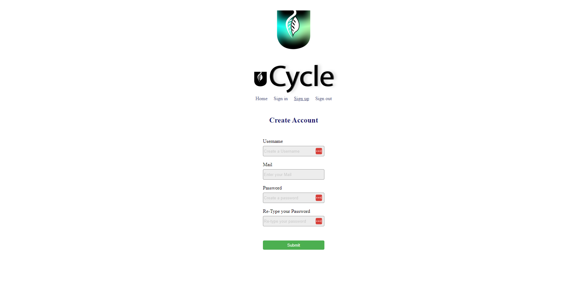
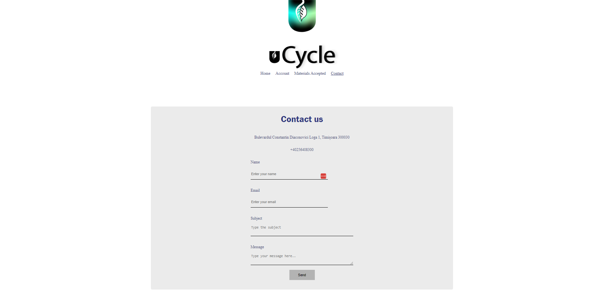
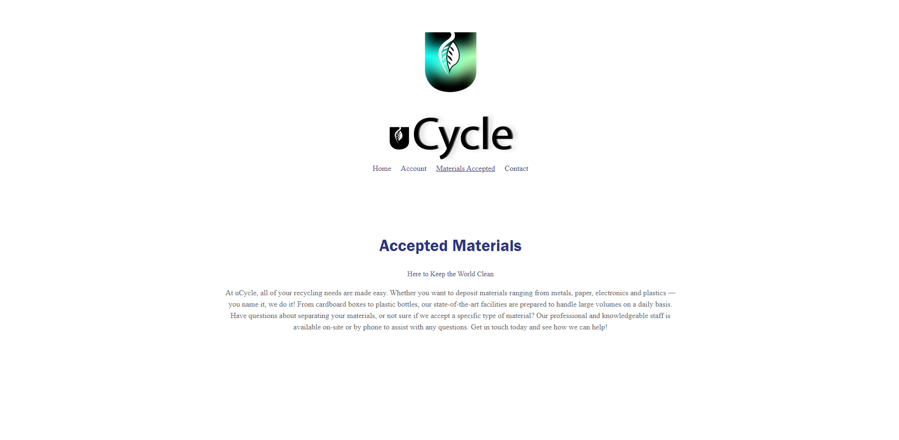

# uCycle

## Let's make Timisoara plasticless.

---

  UCycle brings you a webapp where you can see in real time the closest recycle container near you 
and based on what the container is for the user will see a different color on the map.
   The app provides a feedback system which tells how full is a container. The results are going
to the cityhall page.

---

### For the project we used:

- [x] Javascript
- [x] HTML and CSS
- [x] Python - Flask
- [ ] Others code
- [x] Git and Github
- [x] Google Maps APIs

---

### Some preview of the project:

---
### Team

**Cristian**
: Design, Logo, Map Design

**Iulian**
: Backend, Frontend, Javascript Interactions

**Ovidiu**
: Location Algorithms, UI/UX

**Paul**
: Documentation, UI/UX

**Traian**
: Backend, Frontend, Javascript Interactions

---

*This project was made for a hackathon: Unihack 2021 and for completion we had 48 hours*
